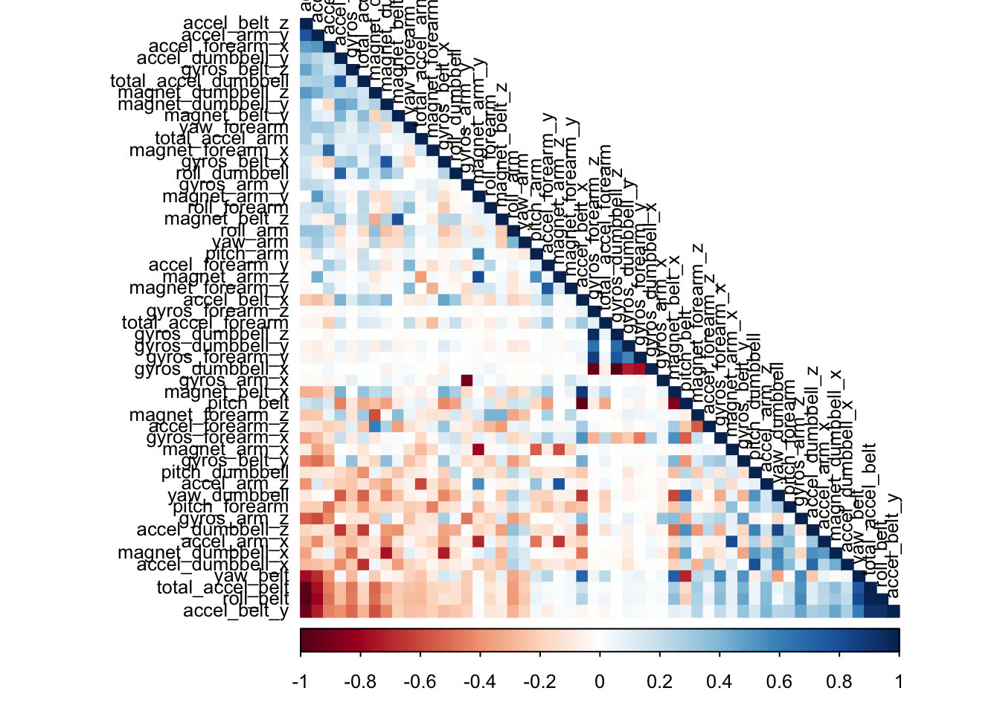

# Intoduction

In recent years using devices such as Jawbone Up, Nike FuelBand, and Fitbit has become more popular, and has made possible to collect more data. This data teaches us about the frequency of the movement one does. In this perticular project, our goal is to analyze the data from the accelerometers in belt, forearm, arm and dumbell form from 6 different participants. These participants will do the barbell lift exercise in 5 different ways. Out outcome will the the "classe" variable which will predict the manner in which they did the exercise. 

# Getting, Cleaning and Exploring the Data

## Preparing Environment 
Before we start, its good practice to load all the libraries that will be necessary for the project. 
We also want to set the seed so we get a reproducible report.

```r
library(knitr)
library(caret)
```

```
## Loading required package: lattice
```

```
## Loading required package: ggplot2
```

```r
library(rpart)
library(rpart.plot)
library(rattle)
```

```
## Loading required package: tibble
```

```
## Loading required package: bitops
```

```
## Rattle: A free graphical interface for data science with R.
## Version 5.4.0 Copyright (c) 2006-2020 Togaware Pty Ltd.
## Type 'rattle()' to shake, rattle, and roll your data.
```

```r
library(randomForest)
```

```
## randomForest 4.6-14
```

```
## Type rfNews() to see new features/changes/bug fixes.
```

```
## 
## Attaching package: 'randomForest'
```

```
## The following object is masked from 'package:rattle':
## 
##     importance
```

```
## The following object is masked from 'package:ggplot2':
## 
##     margin
```

```r
library(corrplot)
```

```
## corrplot 0.84 loaded
```

```r
set.seed(1221)
```

## Loading the Data
First we need to load the training and testing data and look at their dimensions.
Because the data is already split into two different files, we will not need to split in into training and
testing sets.

```r
training <- read.csv("pml-training.csv")
testing <- read.csv("pml-testing.csv")
dim(training)
```

```
## [1] 19622   160
```

```r
dim(testing)
```

```
## [1]  20 160
```

## Cleaining the Data
After looking at the data we notice that there are a lot of NA's that need to be removed. 

```r
training_data <- training[, colSums(is.na(training))==0]
testing_data <- testing[, colSums(is.na(testing))==0]
dim(training_data)
```

```
## [1] 19622    93
```

```r
dim(testing_data)
```

```
## [1] 20 60
```

Now we will remove the first 7 columns that don't help us much.

```r
training_data <- training_data[, -(1:7)]
testing_data <- testing_data[, -(1:7)]
dim(training_data)
```

```
## [1] 19622    86
```

```r
dim(testing_data)
```

```
## [1] 20 53
```

Because we want to get the highest accuracy possible, we will want to split the training data into training and testing sets.
This will allow us to test the models before the actual testing, and therefore receive the accuracy and choose the best model.

```r
inTrain <- createDataPartition(training_data$classe, p = 0.7, list = FALSE)
trainSet <- training_data[inTrain, ]
testSet <- training_data[-inTrain, ]
dim(trainSet)
```

```
## [1] 13737    86
```

```r
dim(testSet)
```

```
## [1] 5885   86
```

We now will take the cleaning another level using the nearZeroVar function.

```r
NZV <- nearZeroVar(trainSet)
trainData <- trainSet[, -NZV]
testData  <- testSet[, -NZV]
dim(trainData)
```

```
## [1] 13737    53
```

```r
dim(testData)
```

```
## [1] 5885   53
```

# General Analysis (correlation)
At this point we cleaned the training and testing sets.
Before we use different methods to model the training data, we will plot the correlation between the different variables. This will help us undersdant the relationships within the data. The darker the color - the more correlation.
The correlations will be with all all but the classe variable (last column - 53) because that's our outcome variable.


```r
training_outcome <- trainData[,-53]
correlation_Mat <- cor(training_outcome)
corrplot(correlation_Mat, order = "FPC", method = "color", type = "lower", 
         tl.cex = 0.8, tl.col = rgb(0, 0, 0))
```

<!-- -->

## Prediction Models

Now we want to build the model. There are different methods to do this, and here we will use 3 different methods and evaluate their accuracy. In the end we will see which is the most accurate. The three methods we will use are random forest, decision tree and boosting. 

### Random Forest


```r
# Here we will use the cross validation method in the training control
controlRF <- trainControl(method="cv", number=3, verboseIter=FALSE)
# Build model
modelFitRF <- train(classe~. , data = trainData, method = "rf", trControl = controlRF)
modelFitRF
```

```
## Random Forest 
## 
## 13737 samples
##    52 predictor
##     5 classes: 'A', 'B', 'C', 'D', 'E' 
## 
## No pre-processing
## Resampling: Cross-Validated (3 fold) 
## Summary of sample sizes: 9157, 9158, 9159 
## Resampling results across tuning parameters:
## 
##   mtry  Accuracy   Kappa    
##    2    0.9871880  0.9837922
##   27    0.9880616  0.9848977
##   52    0.9799081  0.9745802
## 
## Accuracy was used to select the optimal model using the largest value.
## The final value used for the model was mtry = 27.
```

Now we will use the model on the testing data:


```r
predRF <- predict(modelFitRF, testData)
cmRF <- confusionMatrix(factor(testData$classe), predRF)
cmRF
```

```
## Confusion Matrix and Statistics
## 
##           Reference
## Prediction    A    B    C    D    E
##          A 1673    1    0    0    0
##          B    2 1135    2    0    0
##          C    0   15 1000   11    0
##          D    0    0    9  954    1
##          E    0    0    1    4 1077
## 
## Overall Statistics
##                                           
##                Accuracy : 0.9922          
##                  95% CI : (0.9896, 0.9943)
##     No Information Rate : 0.2846          
##     P-Value [Acc > NIR] : < 2.2e-16       
##                                           
##                   Kappa : 0.9901          
##                                           
##  Mcnemar's Test P-Value : NA              
## 
## Statistics by Class:
## 
##                      Class: A Class: B Class: C Class: D Class: E
## Sensitivity            0.9988   0.9861   0.9881   0.9845   0.9991
## Specificity            0.9998   0.9992   0.9947   0.9980   0.9990
## Pos Pred Value         0.9994   0.9965   0.9747   0.9896   0.9954
## Neg Pred Value         0.9995   0.9966   0.9975   0.9970   0.9998
## Prevalence             0.2846   0.1956   0.1720   0.1647   0.1832
## Detection Rate         0.2843   0.1929   0.1699   0.1621   0.1830
## Detection Prevalence   0.2845   0.1935   0.1743   0.1638   0.1839
## Balanced Accuracy      0.9993   0.9926   0.9914   0.9912   0.9990
```

```r
# plot matrix
plot(cmRF$table, col = cmRF$byClass, 
     main = paste("Random Forest - Accuracy =", round(cmRF$overall['Accuracy'], 4)))
```

<!-- -->

### Decision Tree


```r
# Build model
modelFitDT <- rpart(classe~. , data = trainData, method = "class")
modelFitDT
```

```
## n= 13737 
## 
## node), split, n, loss, yval, (yprob)
##       * denotes terminal node
## 
##     1) root 13737 9831 A (0.28 0.19 0.17 0.16 0.18)  
##       2) roll_belt< 130.5 12618 8718 A (0.31 0.21 0.19 0.18 0.11)  
##         4) pitch_forearm< -33.95 1136    7 A (0.99 0.0062 0 0 0) *
##         5) pitch_forearm>=-33.95 11482 8711 A (0.24 0.23 0.21 0.2 0.12)  
##          10) magnet_dumbbell_y< 439.5 9715 7001 A (0.28 0.18 0.24 0.19 0.11)  
##            20) roll_forearm< 122.5 6037 3589 A (0.41 0.18 0.18 0.17 0.063)  
##              40) magnet_dumbbell_z< -27.5 2028  675 A (0.67 0.22 0.011 0.075 0.03)  
##                80) roll_forearm>=-136.5 1682  366 A (0.78 0.18 0.013 0.021 0.0048) *
##                81) roll_forearm< -136.5 346  207 B (0.11 0.4 0 0.34 0.15) *
##              41) magnet_dumbbell_z>=-27.5 4009 2914 A (0.27 0.16 0.27 0.21 0.08)  
##                82) yaw_belt>=169.5 477   57 A (0.88 0.057 0 0.061 0.0021) *
##                83) yaw_belt< 169.5 3532 2453 C (0.19 0.18 0.31 0.23 0.09)  
##                 166) accel_dumbbell_y>=-40.5 3063 2251 D (0.22 0.2 0.22 0.27 0.098)  
##                   332) pitch_belt< -42.95 360   71 B (0.022 0.8 0.11 0.039 0.028) *
##                   333) pitch_belt>=-42.95 2703 1905 D (0.25 0.12 0.23 0.3 0.11)  
##                     666) roll_belt>=125.5 651  273 C (0.37 0.029 0.58 0.012 0.0031)  
##                      1332) magnet_belt_z< -323.5 215    8 A (0.96 0 0.028 0 0.0093) *
##                      1333) magnet_belt_z>=-323.5 436   64 C (0.085 0.044 0.85 0.018 0) *
##                     667) roll_belt< 125.5 2052 1262 D (0.2 0.15 0.12 0.38 0.14)  
##                      1334) pitch_belt>=1.035 1326 1013 A (0.24 0.21 0.14 0.22 0.19)  
##                        2668) accel_dumbbell_z< 27.5 840  549 A (0.35 0.13 0.21 0.27 0.037)  
##                          5336) yaw_forearm>=-94.65 601  310 A (0.48 0.17 0.22 0.083 0.037)  
##                           10672) magnet_forearm_z>=-119.5 393  108 A (0.73 0.13 0.01 0.099 0.033) *
##                           10673) magnet_forearm_z< -119.5 208   78 C (0.029 0.25 0.62 0.053 0.043) *
##                          5337) yaw_forearm< -94.65 239   59 D (0 0.033 0.18 0.75 0.038) *
##                        2669) accel_dumbbell_z>=27.5 486  259 E (0.045 0.34 0.01 0.13 0.47)  
##                          5338) roll_dumbbell< 38.61985 166   38 B (0.042 0.77 0.03 0.042 0.11) *
##                          5339) roll_dumbbell>=38.61985 320  112 E (0.047 0.12 0 0.18 0.65) *
##                      1335) pitch_belt< 1.035 726  231 D (0.15 0.033 0.098 0.68 0.041)  
##                        2670) yaw_arm< -101.05 100    0 A (1 0 0 0 0) *
##                        2671) yaw_arm>=-101.05 626  131 D (0.0096 0.038 0.11 0.79 0.048) *
##                 167) accel_dumbbell_y< -40.5 469   59 C (0.0085 0.049 0.87 0.028 0.041) *
##            21) roll_forearm>=122.5 3678 2451 C (0.072 0.18 0.33 0.23 0.19)  
##              42) magnet_dumbbell_y< 291.5 2146 1093 C (0.085 0.14 0.49 0.15 0.14)  
##                84) magnet_forearm_z< -251 157   34 A (0.78 0.089 0 0.038 0.089) *
##                85) magnet_forearm_z>=-251 1989  936 C (0.03 0.14 0.53 0.16 0.14)  
##                 170) pitch_belt>=26.15 129   25 B (0.1 0.81 0.016 0 0.078) *
##                 171) pitch_belt< 26.15 1860  809 C (0.025 0.094 0.57 0.17 0.15) *
##              43) magnet_dumbbell_y>=291.5 1532 1006 D (0.055 0.23 0.11 0.34 0.25)  
##                86) accel_forearm_x>=-90.5 949  609 E (0.047 0.3 0.15 0.14 0.36)  
##                 172) magnet_arm_y>=188.5 380  172 B (0.016 0.55 0.24 0.082 0.12) *
##                 173) magnet_arm_y< 188.5 569  274 E (0.069 0.14 0.1 0.17 0.52) *
##                87) accel_forearm_x< -90.5 583  187 D (0.067 0.12 0.046 0.68 0.084) *
##          11) magnet_dumbbell_y>=439.5 1767  867 B (0.032 0.51 0.038 0.23 0.19)  
##            22) total_accel_dumbbell>=5.5 1275  450 B (0.045 0.65 0.053 0.027 0.23)  
##              44) roll_belt>=-0.58 1076  251 B (0.053 0.77 0.063 0.032 0.086) *
##              45) roll_belt< -0.58 199    0 E (0 0 0 0 1) *
##            23) total_accel_dumbbell< 5.5 492  124 D (0 0.15 0 0.75 0.1) *
##       3) roll_belt>=130.5 1119    6 E (0.0054 0 0 0 0.99) *
```

```r
# Plot decision tree
fancyRpartPlot(modelFitDT)
```

```
## Warning: labs do not fit even at cex 0.15, there may be some overplotting
```

<!-- -->

Now we will use the model on the testing data:

```r
predDT <- predict(modelFitDT, testData, type = "class")
cmDT <- confusionMatrix(factor(testData$classe), predDT)
cmDT
```

```
## Confusion Matrix and Statistics
## 
##           Reference
## Prediction    A    B    C    D    E
##          A 1515   57   49   21   32
##          B  144  751  106   85   53
##          C   16   98  821   61   30
##          D   54   75  157  622   56
##          E   23   93  139   55  772
## 
## Overall Statistics
##                                           
##                Accuracy : 0.7614          
##                  95% CI : (0.7503, 0.7723)
##     No Information Rate : 0.2977          
##     P-Value [Acc > NIR] : < 2.2e-16       
##                                           
##                   Kappa : 0.6978          
##                                           
##  Mcnemar's Test P-Value : < 2.2e-16       
## 
## Statistics by Class:
## 
##                      Class: A Class: B Class: C Class: D Class: E
## Sensitivity            0.8647   0.6993   0.6454   0.7370   0.8187
## Specificity            0.9615   0.9194   0.9556   0.9322   0.9373
## Pos Pred Value         0.9050   0.6594   0.8002   0.6452   0.7135
## Neg Pred Value         0.9437   0.9319   0.9072   0.9549   0.9644
## Prevalence             0.2977   0.1825   0.2161   0.1434   0.1602
## Detection Rate         0.2574   0.1276   0.1395   0.1057   0.1312
## Detection Prevalence   0.2845   0.1935   0.1743   0.1638   0.1839
## Balanced Accuracy      0.9131   0.8093   0.8005   0.8346   0.8780
```

```r
# plot matrix
plot(cmDT$table, col = cmDT$byClass, 
     main = paste("Decision Tree - Accuracy =", round(cmDT$overall['Accuracy'], 4)))
```

<!-- -->

### Boosting


```r
# Here we will use the repeated cross validation method for the training control
controlGBM <- trainControl(method = "repeatedcv", number = 5, repeats = 1, verboseIter = FALSE)
#Build model
modelFitGBM <- train(classe~. , data = trainData, method = "gbm", trControl = controlGBM)
```

```
## Iter   TrainDeviance   ValidDeviance   StepSize   Improve
##      1        1.6094             nan     0.1000    0.1331
##      2        1.5232             nan     0.1000    0.0870
##      3        1.4642             nan     0.1000    0.0663
##      4        1.4204             nan     0.1000    0.0552
##      5        1.3847             nan     0.1000    0.0520
##      6        1.3517             nan     0.1000    0.0384
##      7        1.3264             nan     0.1000    0.0363
##      8        1.3025             nan     0.1000    0.0333
##      9        1.2808             nan     0.1000    0.0345
##     10        1.2580             nan     0.1000    0.0302
##     20        1.1023             nan     0.1000    0.0181
##     40        0.9296             nan     0.1000    0.0105
##     60        0.8223             nan     0.1000    0.0079
##     80        0.7407             nan     0.1000    0.0037
##    100        0.6772             nan     0.1000    0.0037
##    120        0.6266             nan     0.1000    0.0027
##    140        0.5838             nan     0.1000    0.0036
##    150        0.5638             nan     0.1000    0.0031
## 
## Iter   TrainDeviance   ValidDeviance   StepSize   Improve
##      1        1.6094             nan     0.1000    0.1860
##      2        1.4896             nan     0.1000    0.1307
##      3        1.4055             nan     0.1000    0.1046
##      4        1.3380             nan     0.1000    0.0887
##      5        1.2811             nan     0.1000    0.0750
##      6        1.2319             nan     0.1000    0.0661
##      7        1.1902             nan     0.1000    0.0649
##      8        1.1501             nan     0.1000    0.0496
##      9        1.1176             nan     0.1000    0.0401
##     10        1.0909             nan     0.1000    0.0411
##     20        0.8893             nan     0.1000    0.0222
##     40        0.6805             nan     0.1000    0.0132
##     60        0.5556             nan     0.1000    0.0103
##     80        0.4662             nan     0.1000    0.0065
##    100        0.3979             nan     0.1000    0.0028
##    120        0.3464             nan     0.1000    0.0032
##    140        0.3054             nan     0.1000    0.0021
##    150        0.2875             nan     0.1000    0.0022
## 
## Iter   TrainDeviance   ValidDeviance   StepSize   Improve
##      1        1.6094             nan     0.1000    0.2402
##      2        1.4601             nan     0.1000    0.1602
##      3        1.3591             nan     0.1000    0.1210
##      4        1.2817             nan     0.1000    0.1020
##      5        1.2159             nan     0.1000    0.0868
##      6        1.1612             nan     0.1000    0.0833
##      7        1.1082             nan     0.1000    0.0583
##      8        1.0701             nan     0.1000    0.0684
##      9        1.0283             nan     0.1000    0.0556
##     10        0.9935             nan     0.1000    0.0443
##     20        0.7628             nan     0.1000    0.0262
##     40        0.5281             nan     0.1000    0.0122
##     60        0.4068             nan     0.1000    0.0060
##     80        0.3250             nan     0.1000    0.0053
##    100        0.2683             nan     0.1000    0.0023
##    120        0.2243             nan     0.1000    0.0018
##    140        0.1906             nan     0.1000    0.0015
##    150        0.1765             nan     0.1000    0.0010
## 
## Iter   TrainDeviance   ValidDeviance   StepSize   Improve
##      1        1.6094             nan     0.1000    0.1269
##      2        1.5252             nan     0.1000    0.0887
##      3        1.4665             nan     0.1000    0.0698
##      4        1.4227             nan     0.1000    0.0544
##      5        1.3878             nan     0.1000    0.0450
##      6        1.3581             nan     0.1000    0.0456
##      7        1.3293             nan     0.1000    0.0333
##      8        1.3074             nan     0.1000    0.0368
##      9        1.2841             nan     0.1000    0.0339
##     10        1.2620             nan     0.1000    0.0308
##     20        1.1082             nan     0.1000    0.0193
##     40        0.9348             nan     0.1000    0.0085
##     60        0.8286             nan     0.1000    0.0056
##     80        0.7478             nan     0.1000    0.0050
##    100        0.6852             nan     0.1000    0.0040
##    120        0.6340             nan     0.1000    0.0027
##    140        0.5920             nan     0.1000    0.0024
##    150        0.5712             nan     0.1000    0.0024
## 
## Iter   TrainDeviance   ValidDeviance   StepSize   Improve
##      1        1.6094             nan     0.1000    0.1834
##      2        1.4889             nan     0.1000    0.1268
##      3        1.4052             nan     0.1000    0.1007
##      4        1.3416             nan     0.1000    0.0859
##      5        1.2863             nan     0.1000    0.0715
##      6        1.2406             nan     0.1000    0.0670
##      7        1.1987             nan     0.1000    0.0596
##      8        1.1616             nan     0.1000    0.0553
##      9        1.1264             nan     0.1000    0.0461
##     10        1.0974             nan     0.1000    0.0372
##     20        0.8951             nan     0.1000    0.0207
##     40        0.6824             nan     0.1000    0.0086
##     60        0.5572             nan     0.1000    0.0078
##     80        0.4676             nan     0.1000    0.0038
##    100        0.4027             nan     0.1000    0.0046
##    120        0.3487             nan     0.1000    0.0028
##    140        0.3050             nan     0.1000    0.0020
##    150        0.2880             nan     0.1000    0.0018
## 
## Iter   TrainDeviance   ValidDeviance   StepSize   Improve
##      1        1.6094             nan     0.1000    0.2321
##      2        1.4607             nan     0.1000    0.1605
##      3        1.3581             nan     0.1000    0.1327
##      4        1.2760             nan     0.1000    0.0987
##      5        1.2132             nan     0.1000    0.0808
##      6        1.1602             nan     0.1000    0.0706
##      7        1.1137             nan     0.1000    0.0696
##      8        1.0708             nan     0.1000    0.0577
##      9        1.0333             nan     0.1000    0.0638
##     10        0.9940             nan     0.1000    0.0518
##     20        0.7529             nan     0.1000    0.0213
##     40        0.5269             nan     0.1000    0.0098
##     60        0.4097             nan     0.1000    0.0087
##     80        0.3274             nan     0.1000    0.0043
##    100        0.2666             nan     0.1000    0.0032
##    120        0.2238             nan     0.1000    0.0025
##    140        0.1905             nan     0.1000    0.0025
##    150        0.1754             nan     0.1000    0.0011
## 
## Iter   TrainDeviance   ValidDeviance   StepSize   Improve
##      1        1.6094             nan     0.1000    0.1295
##      2        1.5227             nan     0.1000    0.0868
##      3        1.4645             nan     0.1000    0.0648
##      4        1.4209             nan     0.1000    0.0574
##      5        1.3849             nan     0.1000    0.0443
##      6        1.3562             nan     0.1000    0.0455
##      7        1.3271             nan     0.1000    0.0410
##      8        1.3021             nan     0.1000    0.0311
##      9        1.2819             nan     0.1000    0.0336
##     10        1.2597             nan     0.1000    0.0347
##     20        1.1024             nan     0.1000    0.0190
##     40        0.9303             nan     0.1000    0.0099
##     60        0.8226             nan     0.1000    0.0063
##     80        0.7412             nan     0.1000    0.0047
##    100        0.6800             nan     0.1000    0.0049
##    120        0.6272             nan     0.1000    0.0020
##    140        0.5844             nan     0.1000    0.0034
##    150        0.5656             nan     0.1000    0.0023
## 
## Iter   TrainDeviance   ValidDeviance   StepSize   Improve
##      1        1.6094             nan     0.1000    0.1905
##      2        1.4872             nan     0.1000    0.1282
##      3        1.4055             nan     0.1000    0.1061
##      4        1.3376             nan     0.1000    0.0837
##      5        1.2840             nan     0.1000    0.0738
##      6        1.2377             nan     0.1000    0.0595
##      7        1.1990             nan     0.1000    0.0628
##      8        1.1602             nan     0.1000    0.0540
##      9        1.1261             nan     0.1000    0.0457
##     10        1.0971             nan     0.1000    0.0467
##     20        0.8906             nan     0.1000    0.0181
##     40        0.6845             nan     0.1000    0.0122
##     60        0.5620             nan     0.1000    0.0067
##     80        0.4703             nan     0.1000    0.0043
##    100        0.4030             nan     0.1000    0.0037
##    120        0.3499             nan     0.1000    0.0035
##    140        0.3104             nan     0.1000    0.0024
##    150        0.2917             nan     0.1000    0.0012
## 
## Iter   TrainDeviance   ValidDeviance   StepSize   Improve
##      1        1.6094             nan     0.1000    0.2345
##      2        1.4599             nan     0.1000    0.1641
##      3        1.3553             nan     0.1000    0.1205
##      4        1.2784             nan     0.1000    0.1093
##      5        1.2087             nan     0.1000    0.0856
##      6        1.1543             nan     0.1000    0.0809
##      7        1.1031             nan     0.1000    0.0678
##      8        1.0605             nan     0.1000    0.0566
##      9        1.0227             nan     0.1000    0.0584
##     10        0.9852             nan     0.1000    0.0470
##     20        0.7583             nan     0.1000    0.0279
##     40        0.5262             nan     0.1000    0.0114
##     60        0.4060             nan     0.1000    0.0059
##     80        0.3240             nan     0.1000    0.0053
##    100        0.2610             nan     0.1000    0.0020
##    120        0.2211             nan     0.1000    0.0017
##    140        0.1867             nan     0.1000    0.0010
##    150        0.1721             nan     0.1000    0.0010
## 
## Iter   TrainDeviance   ValidDeviance   StepSize   Improve
##      1        1.6094             nan     0.1000    0.1330
##      2        1.5233             nan     0.1000    0.0901
##      3        1.4640             nan     0.1000    0.0679
##      4        1.4188             nan     0.1000    0.0528
##      5        1.3836             nan     0.1000    0.0472
##      6        1.3528             nan     0.1000    0.0420
##      7        1.3253             nan     0.1000    0.0422
##      8        1.2995             nan     0.1000    0.0377
##      9        1.2757             nan     0.1000    0.0284
##     10        1.2572             nan     0.1000    0.0313
##     20        1.1005             nan     0.1000    0.0180
##     40        0.9287             nan     0.1000    0.0106
##     60        0.8200             nan     0.1000    0.0063
##     80        0.7388             nan     0.1000    0.0059
##    100        0.6764             nan     0.1000    0.0040
##    120        0.6249             nan     0.1000    0.0030
##    140        0.5816             nan     0.1000    0.0023
##    150        0.5620             nan     0.1000    0.0017
## 
## Iter   TrainDeviance   ValidDeviance   StepSize   Improve
##      1        1.6094             nan     0.1000    0.1854
##      2        1.4878             nan     0.1000    0.1295
##      3        1.4045             nan     0.1000    0.1077
##      4        1.3378             nan     0.1000    0.0824
##      5        1.2855             nan     0.1000    0.0709
##      6        1.2391             nan     0.1000    0.0747
##      7        1.1930             nan     0.1000    0.0602
##      8        1.1542             nan     0.1000    0.0572
##      9        1.1196             nan     0.1000    0.0406
##     10        1.0932             nan     0.1000    0.0432
##     20        0.8932             nan     0.1000    0.0206
##     40        0.6813             nan     0.1000    0.0081
##     60        0.5546             nan     0.1000    0.0096
##     80        0.4672             nan     0.1000    0.0064
##    100        0.4006             nan     0.1000    0.0030
##    120        0.3457             nan     0.1000    0.0023
##    140        0.3032             nan     0.1000    0.0015
##    150        0.2864             nan     0.1000    0.0014
## 
## Iter   TrainDeviance   ValidDeviance   StepSize   Improve
##      1        1.6094             nan     0.1000    0.2406
##      2        1.4571             nan     0.1000    0.1614
##      3        1.3557             nan     0.1000    0.1204
##      4        1.2790             nan     0.1000    0.1092
##      5        1.2097             nan     0.1000    0.0879
##      6        1.1529             nan     0.1000    0.0802
##      7        1.1028             nan     0.1000    0.0649
##      8        1.0622             nan     0.1000    0.0596
##      9        1.0235             nan     0.1000    0.0654
##     10        0.9817             nan     0.1000    0.0505
##     20        0.7526             nan     0.1000    0.0197
##     40        0.5259             nan     0.1000    0.0119
##     60        0.4016             nan     0.1000    0.0058
##     80        0.3218             nan     0.1000    0.0044
##    100        0.2630             nan     0.1000    0.0024
##    120        0.2201             nan     0.1000    0.0032
##    140        0.1856             nan     0.1000    0.0009
##    150        0.1721             nan     0.1000    0.0016
## 
## Iter   TrainDeviance   ValidDeviance   StepSize   Improve
##      1        1.6094             nan     0.1000    0.1315
##      2        1.5236             nan     0.1000    0.0877
##      3        1.4647             nan     0.1000    0.0657
##      4        1.4213             nan     0.1000    0.0548
##      5        1.3857             nan     0.1000    0.0490
##      6        1.3538             nan     0.1000    0.0456
##      7        1.3249             nan     0.1000    0.0372
##      8        1.3025             nan     0.1000    0.0324
##      9        1.2821             nan     0.1000    0.0356
##     10        1.2608             nan     0.1000    0.0282
##     20        1.1028             nan     0.1000    0.0168
##     40        0.9287             nan     0.1000    0.0106
##     60        0.8214             nan     0.1000    0.0068
##     80        0.7427             nan     0.1000    0.0049
##    100        0.6798             nan     0.1000    0.0045
##    120        0.6257             nan     0.1000    0.0035
##    140        0.5827             nan     0.1000    0.0029
##    150        0.5623             nan     0.1000    0.0026
## 
## Iter   TrainDeviance   ValidDeviance   StepSize   Improve
##      1        1.6094             nan     0.1000    0.1899
##      2        1.4878             nan     0.1000    0.1300
##      3        1.4039             nan     0.1000    0.1070
##      4        1.3371             nan     0.1000    0.0844
##      5        1.2829             nan     0.1000    0.0757
##      6        1.2357             nan     0.1000    0.0609
##      7        1.1965             nan     0.1000    0.0623
##      8        1.1569             nan     0.1000    0.0523
##      9        1.1231             nan     0.1000    0.0446
##     10        1.0941             nan     0.1000    0.0419
##     20        0.8976             nan     0.1000    0.0234
##     40        0.6816             nan     0.1000    0.0112
##     60        0.5528             nan     0.1000    0.0069
##     80        0.4670             nan     0.1000    0.0052
##    100        0.3997             nan     0.1000    0.0023
##    120        0.3475             nan     0.1000    0.0026
##    140        0.3032             nan     0.1000    0.0021
##    150        0.2856             nan     0.1000    0.0022
## 
## Iter   TrainDeviance   ValidDeviance   StepSize   Improve
##      1        1.6094             nan     0.1000    0.2376
##      2        1.4582             nan     0.1000    0.1577
##      3        1.3587             nan     0.1000    0.1205
##      4        1.2828             nan     0.1000    0.0982
##      5        1.2203             nan     0.1000    0.0851
##      6        1.1663             nan     0.1000    0.0896
##      7        1.1119             nan     0.1000    0.0636
##      8        1.0711             nan     0.1000    0.0669
##      9        1.0287             nan     0.1000    0.0652
##     10        0.9861             nan     0.1000    0.0512
##     20        0.7514             nan     0.1000    0.0225
##     40        0.5237             nan     0.1000    0.0145
##     60        0.4005             nan     0.1000    0.0076
##     80        0.3200             nan     0.1000    0.0055
##    100        0.2595             nan     0.1000    0.0026
##    120        0.2197             nan     0.1000    0.0013
##    140        0.1873             nan     0.1000    0.0012
##    150        0.1747             nan     0.1000    0.0021
## 
## Iter   TrainDeviance   ValidDeviance   StepSize   Improve
##      1        1.6094             nan     0.1000    0.2406
##      2        1.4589             nan     0.1000    0.1579
##      3        1.3588             nan     0.1000    0.1264
##      4        1.2794             nan     0.1000    0.1138
##      5        1.2078             nan     0.1000    0.0919
##      6        1.1497             nan     0.1000    0.0721
##      7        1.1036             nan     0.1000    0.0640
##      8        1.0625             nan     0.1000    0.0601
##      9        1.0250             nan     0.1000    0.0599
##     10        0.9887             nan     0.1000    0.0438
##     20        0.7566             nan     0.1000    0.0239
##     40        0.5316             nan     0.1000    0.0109
##     60        0.4089             nan     0.1000    0.0073
##     80        0.3237             nan     0.1000    0.0038
##    100        0.2689             nan     0.1000    0.0036
##    120        0.2252             nan     0.1000    0.0039
##    140        0.1911             nan     0.1000    0.0017
##    150        0.1764             nan     0.1000    0.0016
```

```r
modelFitGBM
```

```
## Stochastic Gradient Boosting 
## 
## 13737 samples
##    52 predictor
##     5 classes: 'A', 'B', 'C', 'D', 'E' 
## 
## No pre-processing
## Resampling: Cross-Validated (5 fold, repeated 1 times) 
## Summary of sample sizes: 10988, 10990, 10990, 10989, 10991 
## Resampling results across tuning parameters:
## 
##   interaction.depth  n.trees  Accuracy   Kappa    
##   1                   50      0.7531505  0.6869908
##   1                  100      0.8209222  0.7733206
##   1                  150      0.8517142  0.8123303
##   2                   50      0.8552101  0.8165256
##   2                  100      0.9063114  0.8814397
##   2                  150      0.9302608  0.9117456
##   3                   50      0.8980125  0.8709083
##   3                  100      0.9427824  0.9276050
##   3                  150      0.9608355  0.9504491
## 
## Tuning parameter 'shrinkage' was held constant at a value of 0.1
## 
## Tuning parameter 'n.minobsinnode' was held constant at a value of 10
## Accuracy was used to select the optimal model using the largest value.
## The final values used for the model were n.trees = 150, interaction.depth =
##  3, shrinkage = 0.1 and n.minobsinnode = 10.
```

Now we will use the model on the testing data:

```r
predGBM <- predict(modelFitGBM, testData)
cmGBM <- confusionMatrix(factor(testData$classe), predGBM)
cmGBM
```

```
## Confusion Matrix and Statistics
## 
##           Reference
## Prediction    A    B    C    D    E
##          A 1649   14    8    3    0
##          B   35 1075   26    1    2
##          C    0   40  972   13    1
##          D    0    3   37  917    7
##          E    1    8    7   14 1052
## 
## Overall Statistics
##                                           
##                Accuracy : 0.9626          
##                  95% CI : (0.9575, 0.9673)
##     No Information Rate : 0.2863          
##     P-Value [Acc > NIR] : < 2.2e-16       
##                                           
##                   Kappa : 0.9527          
##                                           
##  Mcnemar's Test P-Value : 9.752e-07       
## 
## Statistics by Class:
## 
##                      Class: A Class: B Class: C Class: D Class: E
## Sensitivity            0.9786   0.9430   0.9257   0.9673   0.9906
## Specificity            0.9940   0.9865   0.9888   0.9905   0.9938
## Pos Pred Value         0.9851   0.9438   0.9474   0.9512   0.9723
## Neg Pred Value         0.9915   0.9863   0.9839   0.9937   0.9979
## Prevalence             0.2863   0.1937   0.1784   0.1611   0.1805
## Detection Rate         0.2802   0.1827   0.1652   0.1558   0.1788
## Detection Prevalence   0.2845   0.1935   0.1743   0.1638   0.1839
## Balanced Accuracy      0.9863   0.9647   0.9573   0.9789   0.9922
```

```r
# plot matrix
plot(cmGBM$table, col = cmGBM$byClass, 
     main = paste("Boosting - Accuracy =", round(cmGBM$overall['Accuracy'], 4)))
```

<!-- -->
# Apply models to testing set

We built three different models from three different methods. 
Each method got a different accuracy:
 - Random Forest: 0.9915
 - Decision Tree: 0.7477
 - Boosting: 0.9624
 
We will take the model that got the highest accuracy: Random Forest.
Apply on the testing set:


```r
predTEST <- predict(modelFitRF, testing)
predTEST
```

```
##  [1] B A B A A E D B A A B C B A E E A B B B
## Levels: A B C D E
```

